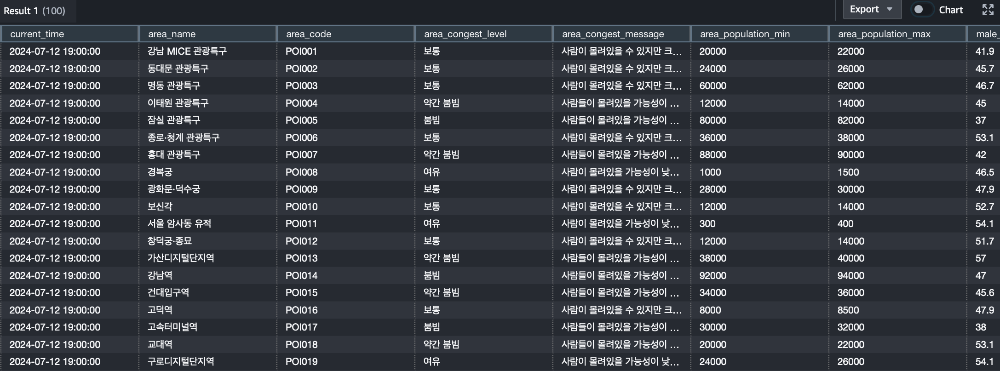

# seoul-population-data-pipeline

## 프로젝트 소개

'서울시 실시간 인구' API를 호출해 서울시 주요 115개 장소에서의 데이터를 추출하고 kafka, spark를 통해 Amazon S3, Redshift에 저장합니다. Airflow를 사용해 자동으로 20분마다 데이터를 추출해 시간에 따른 장소 혼잡도 정도, 실시간 인구 지표, 성별과 나이에 따른 인구 비율 등을 저장하고 시각화합니다.

- ’서울시 실시간 인구 데이터’를 사용해 데이터 추출, 변환, 저장 파이프라인 생성
- Airflow의 custom operator를 제작하고 20분 주기로 API를 호출해 데이터 추출 자동화
- 수집한 데이터를 kafka로 전달하고, spark에서 DataFrame으로 변환 후 S3에 저장
- Glue crawler를 사용해 S3 데이터를 스캔하고 메타데이터를 glue data catalog에 저장
- Redshift, query editor v2를 통해 S3의 데이터를 쿼리하고 분석
- 20분마다 데이터를 추출하고 자동으로 변환을 거쳐  S3에 저장하는 파이프라인 구축

## 프로젝트 목적

‘서울시 실시간 인구’는 열린 데이터 광장에서 제공하는 API로 데이터가 지속적으로 업데이트 됩니다. 서울시 주요 115개 장소에서의 혼잡도 정도, 실시간 인구 지표, 성별과 나이에 따른 인구 비율 등 많은 데이터를 제공하고 있습니다. 더미 데이터를 생성하는 것이 아닌 실제 인구 데이터를 사용하기 때문에 실제성, 활용성이 높을 것으로 예상했습니다.  
또한 데이터가 한번 업데이트되면 이전의 데이터는 조회할 수 없으므로 파이프라인을 제작해 자동으로 데이터를 수집, 저장하면 좋을 것이라 생각했습니다.  
Custom operator를 제작해 20분 주기로 데이터를 수집하며 airflow의 operator에 대한 이해도를 높이고, 다양한 AWS 서비스를 사용해보면서 클라우드 서비스에 대한 이해도를 높이고자 했습니다.  

서울시 실시간 인구 데이터 : https://data.seoul.go.kr/dataList/OA-21778/A/1/datasetView.do

## 시스템 구조

## 구현 설명

- API를 호출해 수집한 데이터를 Kafka로 전달하는 Airflow Custom Operator 
  - 데이터셋 이름, kafka topic 이름 등 간단한 설정만 인자로 입력하면 동작하는 custom operator를 제작했습니다.
  - API를 호출하고 추출한 데이터를 자동으로 kafka로 publish하는 custom operator입니다.
  - 서울시 도시 통합 데이터 API 호출에도 쓰일 수 있도록 설계해 재사용성을 높였습니다.

- 확장성을 위한 Kafka
  - 확장성을 고려해 kafka로부터 spark로 데이터를 전달하는 구조를 선택했습니다.
  - 데이터 생성 시스템과 처리 시스템을 분리할 수 있었습니다.

- 효율적인 데이터 처리를 위한 Spark
  - Kafka에서 수집된 데이터를 실시간으로 처리해 DataFrame으로 변환할 수 있었습니다.
  - Master와 worker를 두어 분산 처리를 활용할 수 있었습니다.

- 안전한 데이터 저장을 위한 S3
  - Spark로부터 데이터를 amazon S3로 전송해 데이터를 안전하게 저장할 수 있었습니다.
  - 데이터를 연도, 월, 일, 시, 분을 기준으로 파티션을 나누어 저장해 데이터 관리 용이성, 접근성을 높였습니다.

- 자동 메타데이터 생성을 위한 Crawler, Glue Data Catalog
  - 확장성을 고려해 다양한 데이터 소스에서 메타데이터를 생성할 수 있는 crawler를 사용했습니다.
  - S3 버킷을 crawler로 스캔해 메타데이터를 생성하고, glue data catalog에 저장된 메타데이터를 기반으로 쉽게 데이터 접근이 가능했습니다.
 

- 데이터 이동 없이 유연한 데이터 조회를 위한 Redshift Spectrum
  - S3에 저장된 데이터를 외부 스키마로 생성해 데이터를 redshift로 이동시키지 않고도 빠르게 조회할 수 있었습니다.

- Redshift, Query Editor v2.0
  - COPY 명령어를 통해 S3에 저장된 데이터를 redshift로 옮겨와 query editor v2를 통해 데이터를 조회할 수 있었습니다.
  - Query editor v2에서 제공하는 차트 기능으로 데이터를 시각화할 수 있었습니다.

## 프로젝트 구성

### 환경 구축
- Docker compose 사용해 컨테이너 구성
- Airflow, Kafka, Spark(1 master, 3 worker) 컨테이너 실행 및 관리

### 데이터 추출
- 데이터셋 이름, kafka topic 이름 등 간단한 설정만 인자로 입력하면 동작하는 custom operator 제작
- API를 호출하고 추출한 데이터를 kafka로 publish하는 custom operator
- 서울시 도시 통합 데이터 API 호출에도 쓰일 수 있도록 제작해 재사용성 높임

### 데이터 변환
- Spark에서 kafka로부터 데이터를 소비
- DataFrame으로 변환 후 S3에 저장

### 데이터 저장
- 연도, 월, 일, 시, 분 기준 파티션을 나누어 S3에 저장
- Glue crawler를 사용해 S3 데이터를 스캔하고 메타데이터를 glue data catalog에 저장
- Redshift에 데이터를 이동시키지 않거나 이동시켜 조회하는 방법 2가지 학습 
  1. Redshift spectrum으로 외부 스키마를 생성해 데이터 이동시키지 않고 S3의 데이터 조회
  2. COPY 명령어를 통해 S3에 저장된 데이터를 redshift로 옮겨와 데이터 조회

### 데이터 시각화
- Query editor v2에서 제공하는 차트 기능으로 데이터를 시각화

## 개발 환경
- Docker compose
- Airflow: 2.9.2
- Scala: 2.12
- OS: Mac

## 실행 방법
1. `custom_image/airflow` 경로 내 Dockerfile로 아래 명령어를 통해 이미지를 생성합니다.  
`sudo docker build -t airflow_custom .`
2. 컨테이너 시작을 위해 `docker compose up -d`
3. Airflow UI `localhost:8080`에 접속해 Connections과 Variables를 설정해야 합니다. `images` 경로 내 이미지를 참고해주세요.  
API key는 열린 데이터 광장에서 직접 발급받아야 합니다.
4. `jobs/config.py`에 각 항목을 문자열로 작성합니다.
5. `docker exec -it seoul-population-data-pipeline-spark-master-1 spark-submit \
--master spark://spark-master:7077 \
--packages org.apache.spark:spark-sql-kafka-0-10_2.12:3.5.0,org.apache.hadoop:hadoop-aws:3.3.1,com.amazonaws:aws-java-sdk:1.11.469 jobs/spark_seoul_population.py`를 입력해 spark job을 실행합니다.

## 서비스 UI 접속
- Airflow: localhost:8080
- Control Center: localhost:9021
- Spark: localhost:9090

## 실행 화면
  
  
  
  
  
  

